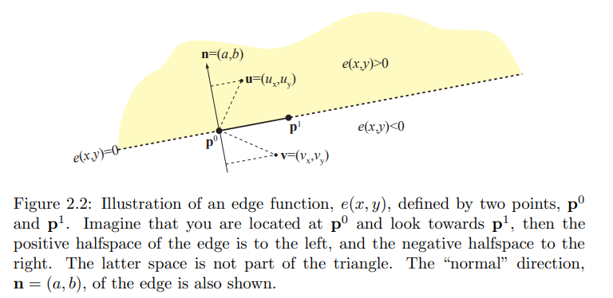
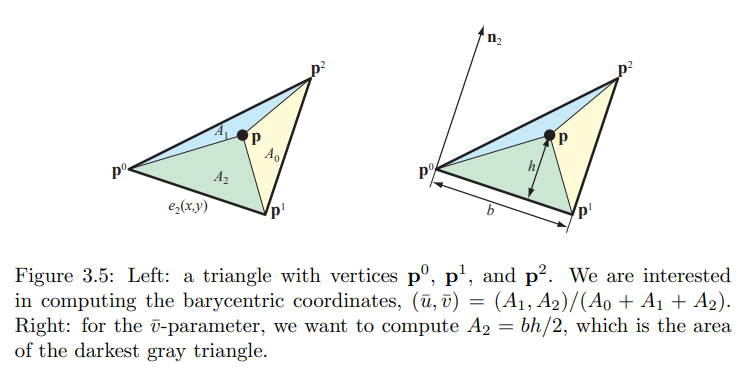
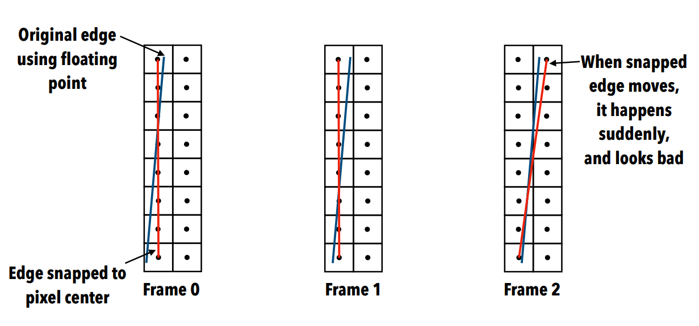
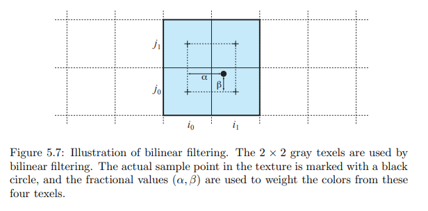
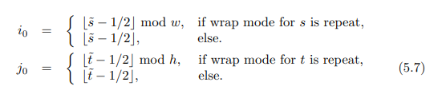
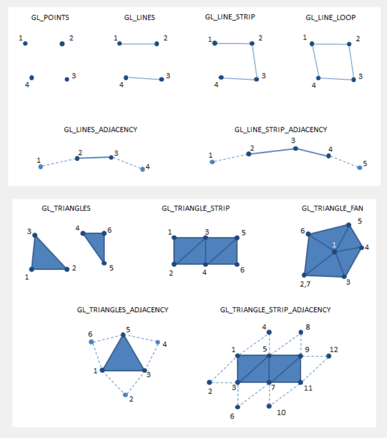

    
## Rasterization
> The process of traversing a triangle and find the pixels that are inside the triangle is often also call rasterization.

### Edge functions

The edge function through p^0  and p^1  can be defined as below:


    e(x,y) = -\frac{p^1_y-p^0_y}{x-p^0_x} + \frac{p^1_x-p^0_x}{y-p^0_y} = ax + by + c = n \cdot (x,y) + c


where p^0  and p^1  are the points which formed the edge, **n** is the normal of the edge, it can be calculated by using the formula n=(a, b) = (-(p^1_y-p^0_y), p^1_x-p^0_x), and point(x, y) the formula n \cdot (x, y) + c may mean the vector p0->(x, y).

 

For each triangle, three edge functions can be defined as below:


    e_0(x,y) = -\frac{p^2_y-p^1_y}{x-p^1_x} + \frac{p^2_x-p^1_x}{y-p^1_y} = ax + by + c = n \cdot (x,y) + c \\
    e_1(x,y) = -\frac{p^0_y-p^2_y}{x-p^2_x} + \frac{p^0_x-p^2_x}{y-p^2_y} = ax + by + c = n \cdot (x,y) + c \\
    e_2(x,y) = -\frac{p^1_y-p^0_y}{x-p^0_x} + \frac{p^1_x-p^0_x}{y-p^0_y} = ax + by + c = n \cdot (x,y) + c
 

ei(x, y) is created by using two vertices pj and pk where i != j and i !=k, this convient when using the edge functions to compute barycentric coordinates.

**Two triangle share an edge** 

A method call tiebreaker rule, in graphics we call it `pixel dropout`, is used to solve the problem that a pixel lying exactly on the shared edge. Here are the pseudocode:

```cpp
bool Inside(e, x, y)
if e(x,y)>0 return true;  // inside the triangle
if e(x,y)<0 return flase; // not inside the triangle
if a>0 return true;       // use a to determine whether the pixel is inside the triangle when e(x,y)=0
if a<0 return flase;
if b>0 return true;       // use b to determine whether the pixel is inside the triangle when b=0
return false;
```

**A nice property of edge function** 

once the edge functions have been created and evaluated for the sample point in one pixel, other 8 neighbor pixels can be easily determined whether it's inside the triangle or not by simply adding or substracting a or b or both of them. More general speaking:


    e(s+t) = e(s) + n \cdot t, n=(a, b)
 

**That's why edge functions are often used  for traversing the pixels inside a triangle**.

for example: 


    e(x+1, y) = e(x, y) + a \\
    e(x, y-1) = e(x, y) - b
 

### Traversal
* Bounding Box Traversal

* Backtrack Traversal

* Zigzag Traversal

* Tiled Traversal: Traverse to the bounding box of the triangle -> Test if tile overlaps with triangle -> traverse pixels inside tile.
    Haines and Wallace found that only need to test two corners which form a diagonal line that most closely aligns with the edge's normal. Then Hoff said that we only need to test one corner which has the greatest projection value on the normal of the edge if the tile is in the negative or positive half space.

### Interpolation
* Barycentric coordinates

The barycentric coordinates for a triangle can be denoted as (\hat{u}, \hat{v}, \hat{w}) which represent the proportion of the signed areas (A_1, A_2, A_3) of the sub-triangles formed by a triangle edge and point P. And we always refer to the normalized barycentric coordinates which is defined below:


    (\hat{u}, \hat{v}, \hat{w}) = \frac{(A_1, A_2, A_3)}{A_\triangle}
 

We can use the **two and half cross product** of edge vector P_0P_1 and P_0P to calculate the sub-area A2. Or we can use **edge function** to do the area calculation.

If we denote the point (x, y) by P then edge function can be rewritten as:


    e(x, y) = n_2 \cdot (p - p_0) = ||n_2|| * ||p - p_0|| * cos \alpha
 

where n_2 is the normal of edge formed by p0, p1, \alpha is the angle between n_2 and vector p - p_0.

And why is the formula could compute the area of sub-triangle A2? The figure below will give the answer:

 

Be carefule with the middle pics, the fact is that u parameter varies linearly from the edge p0p2 to p1 even when the point is outside the triangle. Hence, for a point inside the triangle, it must hold:


    \hat{u} >= 0,\\
    \hat{v} >= 0,\\
    \hat{w} >= 0 && \hat{u} + \hat{v} <= 1
 

 

* Perspective-correct interpolation

The reason why we need to perform perspective-correct interpolation is that perspective transform is often used in computer graphics and we need to handle perspective foreshortening. In order to do that, one need to do is **one division per pixel**.

A **general equation** for perspective-correct interpolation could be defined as:


    s(h_x, h_y, h_w) = kh_x + lh_y + mh_w
 

where s is the value need to be interpolated cross the triangle, (h_x, h_y, h_w) is the coordinate in clip spaces(or scaled view space), k, l, m are baracentric coordinates.

However, since the traverse the pixel inside a triangle is happen in screen space, we can rewrite the general euqation with screen space coordinates (\frac{h_x}{h_w}, \frac{h_y}{h_w}):


    \hat{s}(px, py) = k\frac{h_x}{h_w} + l\frac{h_y}{h_w} + m
 

The interpolated s value we got here actually is **s/w**, but we want rather just s. The solution for this is interpolated **s/w** as well as **1/w**:


    s(px, py) = \frac{\hat{s}(px, py)}{\hat(o)(px, py)}
 

where \hat(o)(px, py) is the interpolation of 1/w.

When we have many parameters to interpolate in perspective, a better way to do that is compute perspectively correct interpolation coordinates once per pixel and then interpolate all parameters using this. The perspective-correct interpolation coordinates is similar to baracentric coordinates but not proportional to the areas of the sub-triangles. We use **u(x,y)** to denote the coordinates.


    u(x, y) = \frac{\hat{s}(px, py)}{\hat(o)(px, py)}
 

Since both s and o are computed using linear interpolation, and so can be computed using (\\hat{u}, \hat{v}) 


    \hat{s}(px, py) = (1-\hat{u}-\hat{v})\frac{h_x}{h^0_w} + l\frac{h_y}{h_w} + m
    \hat{o}(px, py) = k\frac{h_x}{h_w} + l\frac{h_y}{h_w} + m
 


### Q&A
1. Why triangle is better than quadrilateral in rendering?
> four vertices are not needed to be in the same plane, even if they are planar, they could formed a concave polygon which is also complex for hardware. what about rendering a self-intersecting polygon like a star. Triangle is the simplest geometrical entity that could represent a two-dimensional surface.

2. Why the cross product of a and b can represent the area of a parallelogram?
>

2. How to avoid sudden move of a edge if we use pixel grid for vertex positions?
>fixed point math(important!)
use pixel grid for vertex positions means vertex postions are in floating point while pixels are integer positions. This will occur a problem that edge will move suddenly like the pics explain below:

 

6. Why tiled traversal makes possible to implement algorithms that reduces bandwidth usage like buffer compression?

7. Why the scale value of a cross product of two vectors are the area of a parallelogram formed by these two vectors?

8. Why screen space coordinates (px, py) can be represented by eye/view space coordinates (hx, hy, hw)?

## Ray tracing

## Texturing

### maganification
>when the camera is close to a object, which menas more pixel will be used to render this object, the footprint in texture space will be small. For example, a quad covers 512x512 pixels while using a texture only have 64x64. There are mainly **two ways** to solve this situation.

* nearest neighbor sampling
>finding only the single closest texel (i, j) 

* blinear filtering
>the general idea is find the closest 2x2 block to the texture coordinates (s,t), and weight these texel according to the exact location of (s,t).

 

the actual computation is shown below:

 

where \hat{s} = sw, \hat{t} = th, the resolution of the texture is wxh. \alpha = frac(\hat{s}-1/2) \\ \beta = frac(\hat{t} - 1/2) 


### minification
>when the camera is far way from a object, the footprint will cover more than one texel. Bilinear filtering could work only when the footprint is less than 4. **A better solution is Mipmapping**.

The key to Mipmapping is hierarchy of images. We call the original image/texture as level 0, for the next level in the pyramid is lowpass filtered and half width and height of the previous level. **The size of the footprint** is used to estimate d which  determine the level we should acess.


    d = \log_2b = \log_2\sqrt{a} = 0.5\log_2a
 

where b is the side the squared footprint, a is the area of squared footprint.

**It's interesting that when d<0, it's actually maganification.**

A common technique in minification is **trilinear mimpmapping**. Here is the work flow:
1. compute the level info d, and use is to find the closest mipmap levels to d.
2. scale the texture coordinates (s,t) with the respective width and height of the two levels.
3. find the closest 2x2 block to (s,t) in different levels.
4. perform bilinear filtering.
5. perform linearly blending(interpolating) between two differnet levels by using parameter \gamma=frac(d)

## Shaders and PBS

* Shade Tree

### Physically-Based Shading
> a framework to understand and reason about materails cause nowadays material shaders had become very complex. Pay attention to the energy conservation.

**Bidirectional Reflectance Distribution Function**:


    f(l,v) = \frac{F(l,h)G(l,v,h)D(h)}{4(n \cdot l)(n \cdot v)}


where F(l,h) is the Fresnel term, G() is Geometry Function and D() is Normal Distribution Function

### ambient occlusion
* screen space ambient occlusion

### silhouette rendering
>edge detection on both depth and normal buffer and then combine them or using enlarged objects technique(rendering front faces in the frist pass and extruded backfaces are rendered in different color in the second pass).


### Q&A
1. How to simply simulate refraction without using ray tracing?

Refract only ray at first intersection and add fresnel reflection for morerealism

Fast Fresnel Approximation: F = R0 + (1-R0)(1-v*n)^5

where v is view vector, n is the normal and R0 is the reflectivity

2. Hacks of skin rendering(subsurface scattering)

ideally: using subsurface scattering, photons enter material and bounces around inside and exit at another point.

hacks: Wrapping + color shifting + depth maps

Wrapping: Wrap lighting modifies the diffuse function so that the lighting wraps around the object beyond the point where it would normally become dark. The value wrap is a floating-point number between 0 and 1 that controls how far the lighting will wrap around the object.


    f(n,l) = max(\frac{n \cdot l + w}{1+w}, 0)


color shifting:???????????

depth map: put a camera at the back of the object, store the depth value, when rendering the front faces in screen space, for a specific pixel, transform this pixel position from screen space into camera space which we put at the back of the object, fetch the depth value of this point and compare it with the depth value at front face, this distance can be represented as thickness, don't forget to scale it to [0, 1]. And then use this normalized distance to look up the color in a texture.


## Deferred Shading

### Q&A
1. How?
Render Geometry to Geometry buffer(G-Buffer) -> Render lights to accumulative lightbuffer -> resolve by blending lightbuffer and parts of the Geometry buffer to generate the final framebuffer.

2. What's in G-Buffer?
depth, vertex postion, normal, diffuse texture color, specular power and so on.

## Performance Analysis

### gpu Performance
We estimate the performance of a GPU from 2 aspect: hardware specifications and code.

>hardware specifications: clock speed, memory size and speed, number of processing units. We often use TFLOPS-Tera(10^12) floating-point operations per second and memory bandwidth to estimate the performance of a GPU, TFLOPS = cores * clock * flops/cycle, where flops/cycle is a 32bit fp add or multiply per cycle.

>code: algorithm complexity, parallel performance and data locality(data needs to be close to computaion unit and data movement is expensive in time an energy)

uppper limit for graphics: memory bandwidth

### Theoretical performance analysis of rasterizer: **depth complexity, overdraw and bandwidth**
    * depth complexity: measured per pixel, it describe the number of triangles thaWWQtoverlap with a pixel(even though only one triangle will left and write to the pixel). The depth complexity we mention here is often average depth complexity, e.g. d=4 means the average depth complexity for each pixel in the scene is 4(for each pixel, the average overlapped triangle is 4).
    * overdraw: measured per pixel, it's a statistical model to describe how many times we write to a pixel, it often less than or equal to depth complexity.


    o(d) = 1 + \frac{1}{2} + \frac{1}{3} + ... + \frac{1}{d}


where 1 means first triangle is always written, 1/2 means the second triangle has 50% of being in front of previous triangle, 1/3 means the third triangle has 33% of being in front of previous two triangle and so forth.

* bandwidth: 


    b = d x (Z_r + Z_w + C_w + T_r)


but fragments that do not pass the depth test will not need to access texture, write depth and color



    b = d x Z_r + o x (Z_w + C_w + T_r)


and when we take texture cache into account(miss rate), the formula will become like this:


    b = d x Z_r + o x (Z_w + C_w + m x T_r)


Furture work or improvement: 
* texture bandwidth: texture compression
* depth buffer: compression and culling algorithm

## Z culling

implement in hardware, avoid a large amount of unnecessary depth buffer read and write.

### Zmax-culling 
The basic idea of Zmax culling is to avoid depth buffer reads in tiles covered by triangle, where the triangle is definitely behind the contents of the depth buffer in that tile.

To achieve that, each tile should stores a value call Z_max=max[d(i, j)] 

Z_min^tri = max[min(d^k), min(c_i)] 

dk is the depth value of triangle's vertices, ci is the depth value of four corners of a tile

if Z tri min > Z_max, then the tri in that tile is definitely hidden  by the contents of depth buffer

update Z_max, read all depth values of teh tile and use Z_max=max[d(i, j)] to update Z_max

fragments that fail the depth test, thesee are the kind of fragments that Zmax culling reduce work for

### Zmin-culling

Z_min = min[d(i, j)]

Z tri max < Z_min, then the triangle in  that tile is definitely in front of the contents of the depth buffer, when this happen, it's certain that the depth test passes and the depth buffer read can be avoided.

update Z_min is easy, when we find out a depth value d < Z_min, then we can update z_min = d.

### Q&A
1. what's hierarchical z-buffer?

2. what's geometry complexity, is it the same as depth complexity?

## Depth Buffer Compression
>The reason why compression is work well for the depth buffer are that depth value over a triangle is interpolated linearly, which means pixels that are close to each other seem to have similar depth values.

### depth offset compression
The idea is to compute the minimum depth value Z_min and maximum depth value Z_max of a tile. If the following is fulfilled:


    d(i,j) - Z_min < t 
 

then d(i, j) can be encoded as an offset relative to Zmin

or 


    Z_max - d(i, j) < t
 

then d(i, j) can be encoded as an offset relative to Zmax

otherwise, it is stored as uncompressed form.

where t is often choosen as t=w^p 

### plane equation compression

if only a single triangle is fully covering a tile, the plane equation of the triangle could be stored instead.

## Texture Compression

## Anti-aliasing

## GPU Architecture

### different to CPUs
Parallelism: 
1. hardware pipelining(graphics pipleline)
2. SIMD(single instruction multiple data)
3. MIMD(multiple instruction multiple data)

gpu hide large memory request latency by switching between threads

4-wide SIMD Pixel shader: a shader that a single instruction can process 4 different data type, for example, 4-wide SIMD pixel shader can process four color channels RGBA simultaneously。

### unified shader

 <++>

### Tiled Graphics Architecture

Dominant in Mobile(ARM Mali, Apple Ax)

`work flow:` 
1. divide screen into Tiles(for example, each tile has 32x32 pixels)
2. project triangles to the scrren through the graphics pipeline
3. create or store the info may need for tile rendering, like tile triangle lists which store the pointers to all triangles is the tile, tile indices which is a data structure for fast searching which tiles each triangle is intersected with.
4. when rendering, take one tile, rasterized it and run pixel shader for all triangle in that tile list
5. it's important that it use one tile size on-chip memory to store all the infomation about a triangle such as normal, color, depth and so on to make sure that shader could access to these data in a vrey high speed.
6. after processing all the triangles in that tile triangle list, output the on-chip data into framebuffer.

* Disadvantages
    * more on-chip memory is needed
    * triangle can be processed multiple time?
    * on-chip memory limits the number of triangles
* Advantages
    * easily parallelizable
    * Z, color accesses close to free
    * alpha blending is significantly cheaper

### OpenCL(Open Compute Language)


### Expanding the graphics pipeline
* Geometry Shaders
>a new feature in DX10 or OpenGL3.0. It's a programmable shader between tessellation shader and pixel shader in graphics pipeline. Different from  vertex shader, geometry shader could create or destory geometry primitives. More interestingly, the output of geometry shader is totally independent from the input. The input of geometry shader could be points, line, line_strip, line_strip_adjacency, triangle, triangle_strip, triangle_strip_adjacency and so on. The output of geometry shader could be points, line_strip and triangle_strip.

 

* Tessellation
>a new feature in DX11 or OpenGL4.0. Tessellation in graphics pipeline is been divided into 3 stages: tessellation control shader(TCS), tessellation primitive generator and tessellation evaluation shader(TES). A **tcs** is to determine how much tessellation to do in 3 aspects, specifiy the number of vertices per patch, perform any transformations to each vertex of the patch and specifiy the outer and inner tessellation levels to a patch. That means tcs take patch as input, a patch could be a triangle or a quad. **tpg** is responsible for doing the actual tessellation of the patch(generating each intermediate point), the input of a tpg is the output of tcs(e.g. tessellation levels) and input of tes(subdivision spacing rules: equal_spaceing, fractional_odd_spacing and fractional_even_spacing). The job of **tes** is relatively simple - to specify the (x,y,z) location of the generated intermediate points. tcs takes the array of patch, the array of varying attributes, in tcs these attributes such as texture coordinates, normal, color and so forth are interpolated by using the vertices of the patch.

### Q&A
1. What's the difference between non-unified and unified graphics pipeline?
>unified shader graphics pipleline makes vertex and pixel shaders can perform in one hardware, better vertex and pixel resource usage. For example, in a non-unified graphics pipeline, calculate ability for vertex shader and pixel shader stage are constant, that's say 2-wide vertex shader and 4-wide SIMD pixel shader. Image a scene that has bunch of vertices but few colors, the ability of 2-wide vertex shader is not enough for vertex computation, oh the other hand, the calculate ability of pixel shader is wasted. So unified shader graphics pipleline is for balancing vertex and pixel load.

2. Why tiled based rendering makes MSAA almost free?
>tile足够小，于是可以在内存中本地存储足够多的sample，以实现MSAA。因此，硬件可以在tile写回内存期间将多个样本resolve，而无需单独的resolve pass。

3. Why alpha blending is cheaper?
>TBR的主要优点是tile仅占Framebuffer的一小部分。因此，可以将tile的颜色、深度和模板的整个work set存储到与 GPU shader核心紧密耦合的On-chip中。因此，GPU 进行深度测试和混合透明片段所需的Framebuffer数据无就不必要从内存中重复多次进行读写了，从而提升性能，节省能耗。


人不应该设想成功的结果，而是设想成功的过程，你想到结果就已经得到满足了，差距越大越不容易开始
